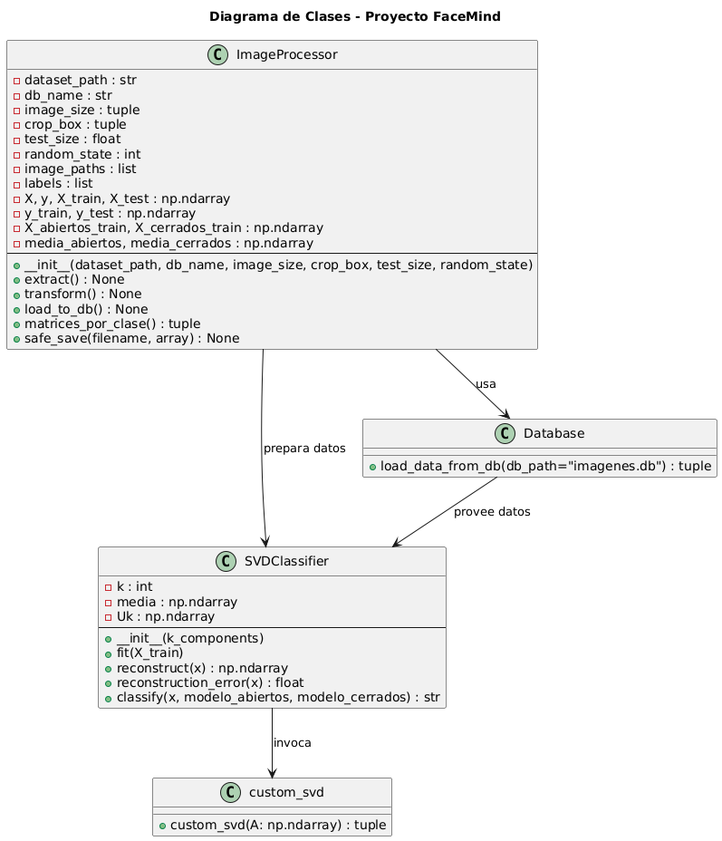

## 👁️ FaceMind 

**FaceMind** es un sistema de análisis facial que aplica la técnica de *Eigen-Objetos* basada en la **Descomposición en Valores Singulares (SVD)** para clasificar imágenes en dos categorías: **ojos abiertos** y **ojos cerrados**.  
El proyecto incluye un pipeline completo de procesamiento, almacenamiento y clasificación, desarrollado en **Python** con enfoque académico y modular.

---

## 📂 Estructura del Proyecto

```
face_mind/
│
├── data/
│   ├── abiertos/              # Carpeta con imágenes de ojos abiertos
│   └── cerrados/              # Carpeta con imágenes de ojos cerrados
│
├── src/
│   ├── image_processor.py     # Módulo ETL: extracción, transformación y carga de imágenes
│   ├── custom_svd.py          # Implementación manual de la Descomposición SVD
│   └── svd_classifier.py      # Clasificador facial basado en SVD
│
├── outputs/
│   ├── imagenes.db            # Base de datos SQLite generada automáticamente
│   ├── X_train.npy            # Matriz de entrenamiento (pixeles × imágenes)
│   ├── X_test.npy             # Matriz de prueba
│   ├── G_abiertos_pixeles.npy # Matriz cuadrada de clase “abiertos”
│   ├── G_cerrados_pixeles.npy # Matriz cuadrada de clase “cerrados”
│   └── medias.npy             # Vectores promedio por clase
│
├── requirements.txt           # Librerías necesarias
└── README.md                  # Documentación completa del proyecto
```

---

## Objetivo del Proyecto

Desarrollar un sistema capaz de **distinguir entre ojos abiertos y cerrados** utilizando técnicas de reducción de dimensionalidad mediante **Eigen-Objetos**.  
El enfoque está inspirado en el modelo de *Eigenfaces* usado en reconocimiento facial, pero adaptado a una tarea específica de **detección ocular**.

---

## Metodología: Eigen-Objetos con SVD

1. **Preprocesamiento de imágenes:**
   - Conversión a escala de grises.
   - Redimensionamiento uniforme a `200×200 px`.
   - Recorte controlado con `crop_box=(5, 40, 190, 150)` para eliminar ruido.
   - Normalización entre `[0, 1]`.

2. **Representación matricial:**
   - Cada imagen se aplana (vectoriza) y se apila horizontalmente formando una gran matriz `X` de tamaño `n_pixeles × n_imágenes`.

3. **SVD personalizada:**
   - Se calcula manualmente la descomposición `X = U Σ Vᵀ`.
   - Se seleccionan los `k` vectores singulares más significativos (`Uk`) para representar la clase.

4. **Clasificación:**
   - Se comparan los **errores de reconstrucción** entre modelos de “abiertos” y “cerrados”.
   - La clase con menor error se considera la predicción final.

---

## ⚙️ Instalación y Requerimientos

### 1️⃣ Crear entorno virtual (opcional pero recomendado)
```bash
python -m venv env
source env/bin/activate      # En Windows: env\Scripts\activate
```

### 2️⃣ Instalar dependencias
```bash
pip install -r requirements.txt
```

### 3️⃣ Verificar estructura del dataset
Asegúrate de tener tus carpetas con imágenes organizadas así:
```
face_mind/data/abiertos/
face_mind/data/cerrados/
```

---

## Modo de Uso

### 1. Procesamiento y carga inicial
Ejecuta el script principal del módulo **ImageProcessor** para generar los archivos base y la base de datos:

```bash
python src/image_processor.py
```

Esto generará:
- La base de datos `imagenes.db`
- Los conjuntos `X_train.npy`, `X_test.npy`, `y_train.npy`, `y_test.npy`
- Las medias y matrices cuadradas de cada clase

### 2. Entrenamiento y prueba del clasificador
Luego, ejecuta el módulo del clasificador SVD:

```bash
python src/svd_classifier.py
```

Esto:
- Entrena modelos para cada clase (`abiertos` y `cerrados`)
- Evalúa una imagen de prueba
- Muestra la predicción final

Ejemplo de salida:
```
Error abiertos: 12.3489 | Error cerrados: 19.2301
 Predicción final: abiertos
```

### 📈 3. Visualización y ajuste
Puedes modificar:
- `k_components` → número de vectores singulares usados
- `image_size` y `crop_box` → para controlar el preprocesamiento
- `test_size` → proporción de prueba

---

## Archivos Principales

### `src/image_processor.py`
Contiene la clase `ImageProcessor`, responsable del pipeline ETL (Extract–Transform–Load).  
Incluye validación, vectorización y almacenamiento de imágenes en SQLite.

### `src/custom_svd.py`
Implementa el algoritmo **SVD** paso a paso sin depender de funciones de alto nivel de NumPy.  
Ideal para aprendizaje académico y demostraciones de eigen-objetos.

### `src/svd_classifier.py`
Define la clase `SVDClassifier`, encargada del entrenamiento y predicción.  
Usa errores de reconstrucción como métrica de decisión entre clases.

---

## Base de Datos SQLite

El archivo `imagenes.db` se genera automáticamente.  
Cada registro contiene:
- **Etiqueta:** `'abiertos'` o `'cerrados'`
- **Vector:** bytes del vector de imagen correspondiente

Puedes inspeccionarlo desde Python o un gestor SQLite:
```python
import sqlite3
conn = sqlite3.connect("outputs/imagenes.db")
cursor = conn.cursor()
cursor.execute("SELECT etiqueta, LENGTH(vector) FROM imagenes LIMIT 5")
print(cursor.fetchall())
```

---

## Ejemplo de Entrenamiento Manual

```python
from src.svd_classifier import SVDClassifier, load_data_from_db

# Cargar datos
X_abiertos, X_cerrados = load_data_from_db("outputs/imagenes.db")

# Crear y entrenar modelos
modelo_a = SVDClassifier(k_components=15)
modelo_c = SVDClassifier(k_components=15)
modelo_a.fit(X_abiertos)
modelo_c.fit(X_cerrados)

# Clasificar una imagen
x_test = X_cerrados[:, 0]
pred = SVDClassifier.classify(x_test, modelo_a, modelo_c)
print("Predicción:", pred)
```

---

## Rutas Relevantes

| Tipo | Ruta | Descripción |
|------|------|--------------|
| Dataset | `face_mind/data/` | Carpeta raíz de imágenes |
| Código fuente | `face_mind/src/` | Contiene los módulos Python principales |
| Base de datos | `face_mind/outputs/imagenes.db` | Almacena los vectores procesados |
| Resultados | `face_mind/outputs/` | Matrices, medias y archivos `.npy` generados |
| Requisitos | `face_mind/requirements.txt` | Dependencias del proyecto |
| Documentación | `face_mind/README.md` | Guía detallada del sistema |

## Diagrama de Clases html – FaceMind

<p align="center">
  
  <br>
  <em>Diagrama de Clases del Proyecto FaceMind</em>
</p>


> Este diagrama muestra la arquitectura modular del sistema FaceMind, donde:
> - **ImageProcessor** realiza el preprocesamiento ETL de las imágenes.  
> - **Database** gestiona el almacenamiento de vectores en SQLite.  
> - **SVDClassifier** entrena modelos por clase y usa la función **custom_svd** para la descomposición.  


---

## 👩‍💻 Créditos

**Autor:** Wilfredo Calderon Perez y Roger Villa Aristizabal


---

## 🧭 Conclusión

FaceMind representa una implementación práctica de los principios de **Eigenfaces**, combinando **matemática aplicada**, **procesamiento digital** y **aprendizaje automático**.  
Permite comprender de manera didáctica cómo los **espacios reducidos de características** pueden capturar patrones visuales significativos.

